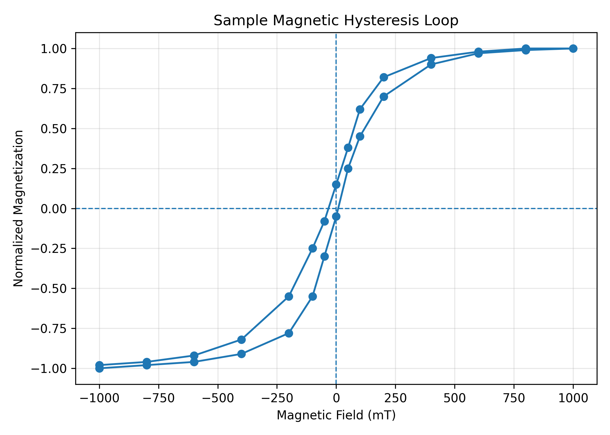
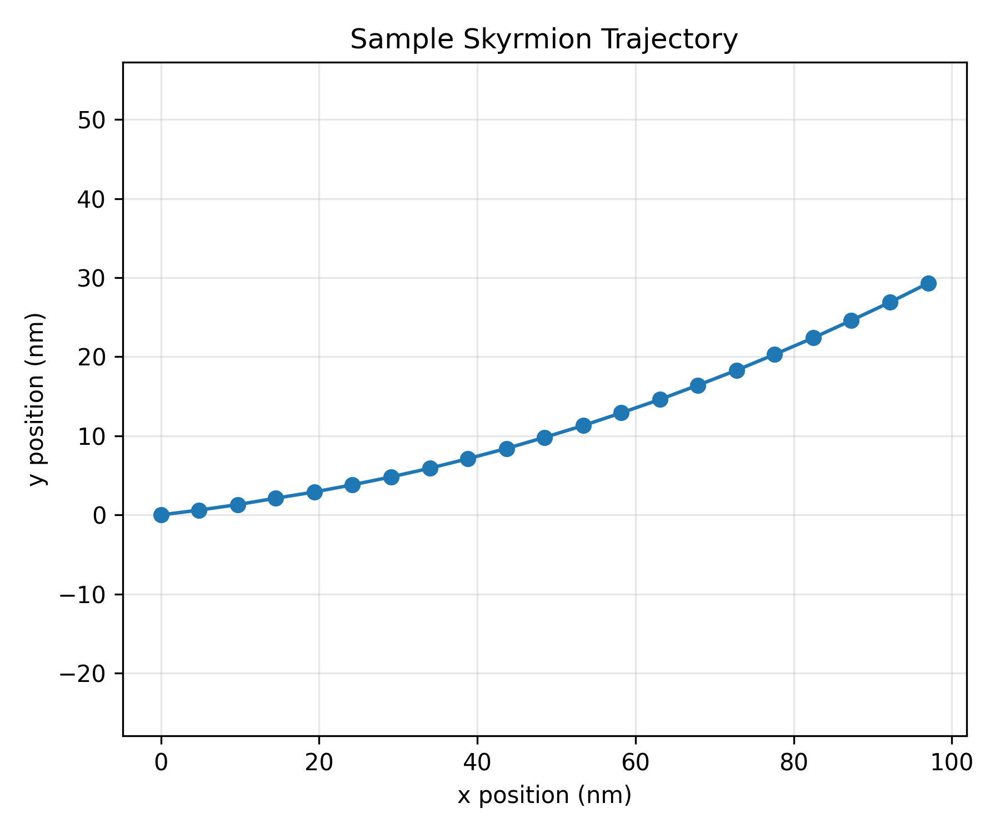
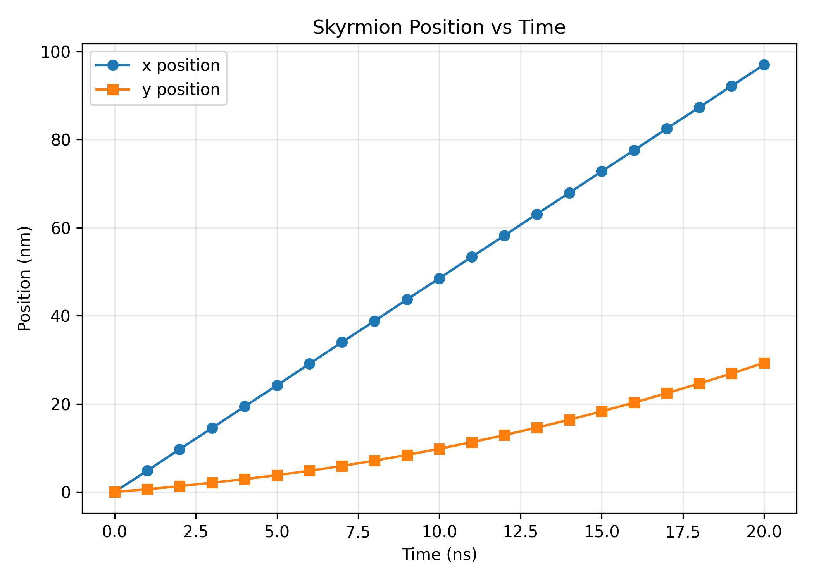

# Materials Simulation Lab

A personal research-oriented repository for materials science simulation, micromagnetic simulation analysis, and materials characterization data processing.

This repository is designed as a long-term academic coding portfolio. It documents my learning and research workflow in computational materials science, Python-based scientific computing, and simulation data visualization.

## About This Repository

My academic background is in physics and materials science. My current research and career interests include:

- Computational materials science
- Micromagnetic simulation
- Skyrmion and spintronic device physics
- Semiconductor materials
- Materials characterization
- Python-based data analysis and visualization

This repository is used to organize small, reproducible projects related to simulation analysis and scientific data processing.

## Example Results

### Hysteresis Loop



### Skyrmion Trajectory



### Skyrmion Position vs Time



## Data Availability

This repository uses lightweight synthetic demo datasets for code demonstration and portfolio purposes.

The full research dataset related to the current-driven Néel skyrmion transport study is hosted on Zenodo and is described in:

```text
DATA.md
```

The associated manuscript is currently under review, and the Zenodo DOI is cited in the manuscript's Data Availability Statement.

The full research dataset is not stored directly in this GitHub repository.

## Current Demo Projects

### 1. Hysteresis Loop Analysis

This demo analyzes a synthetic magnetic hysteresis dataset.

Related files:

```text
examples/sample_hysteresis_data.csv
src/hysteresis_analysis.py
docs/hysteresis_analysis_explanation.md
```

The analysis includes:

- Plotting a hysteresis loop
- Estimating remanent magnetization
- Estimating coercive field
- Saving the generated figure

### 2. Skyrmion Trajectory Analysis

This demo analyzes a synthetic skyrmion trajectory dataset.

Related files:

```text
examples/sample_skyrmion_trajectory.csv
src/skyrmion_trajectory_analysis.py
docs/skyrmion_trajectory_explanation.md
```

The analysis includes:

- Calculating skyrmion displacement
- Calculating average velocity
- Estimating skyrmion Hall angle
- Plotting the trajectory
- Plotting position as a function of time

## Repository Structure

```text
materials-simulation-lab/
│
├── README.md
├── DATA.md
├── LICENSE
├── requirements.txt
├── .gitignore
│
├── docs/
│   ├── how_to_run.md
│   ├── project_notes.md
│   ├── hysteresis_analysis_explanation.md
│   └── skyrmion_trajectory_explanation.md
│
├── examples/
│   ├── sample_hysteresis_data.csv
│   └── sample_skyrmion_trajectory.csv
│
├── mumax3/
│   └── neel_skyrmion_cip_transport_template.mx3
│
├── src/
│   ├── hysteresis_analysis.py
│   ├── skyrmion_trajectory_analysis.py
│   └── run_all.py
│
└── results/
    └── figures/
        ├── hysteresis_loop.png
        ├── skyrmion_trajectory.png
        └── skyrmion_position_vs_time.png

## How to Run

The full running instructions are provided in:

```text
docs/how_to_run.md
```

Basic workflow:

```bash
git clone https://github.com/Gardenia-hash/materials-simulation-lab.git
cd materials-simulation-lab
pip install -r requirements.txt
python src/run_all.py
```

On Windows, if `python` or `pip` is not recognized, use:

```bash
py -m pip install -r requirements.txt
py src/run_all.py
```

## Tools and Libraries

This repository mainly uses Python for scientific data analysis and visualization.

Planned tools and libraries include:

- Python
- NumPy
- Pandas
- Matplotlib
- SciPy
- Jupyter Notebook
- MuMax3

## Important Note

This repository is for public learning, research practice, and portfolio demonstration only.

The following materials should not be uploaded:

- Unpublished manuscript files
- Confidential research data
- Private supervisor or collaborator documents
- Raw experimental data without permission
- Personal documents

Only public demo data, synthetic data, self-written scripts, and reproducible examples should be included.

## Long-Term Goal

The long-term goal of this repository is to build a clean and professional research coding portfolio connecting:

```text
Physics → Materials Science → Simulation → Data Analysis → Research Communication
```
